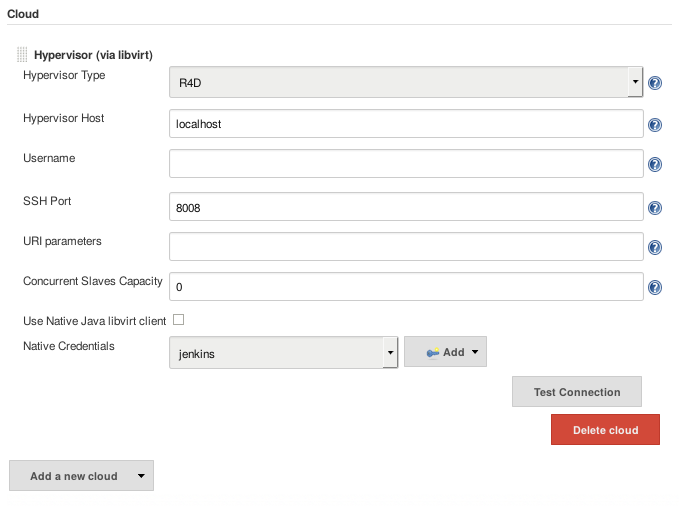
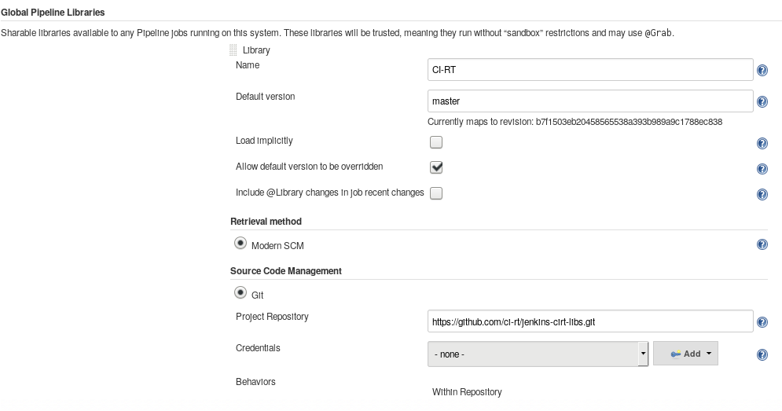
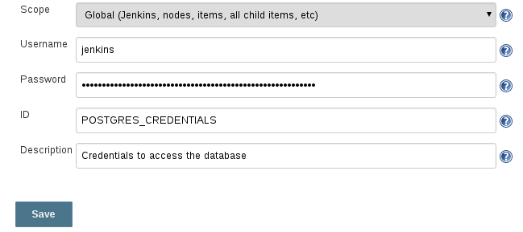
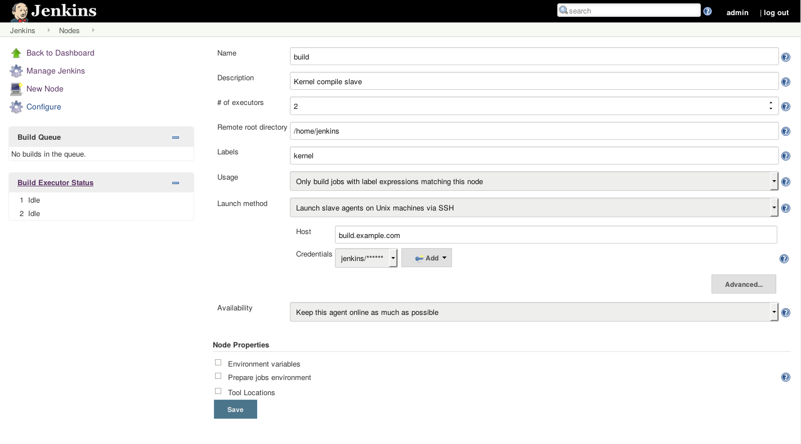
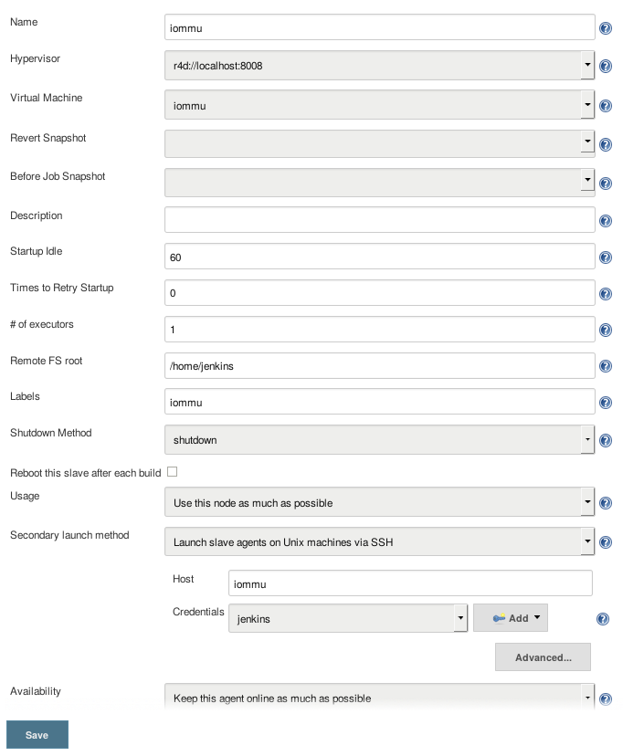

CI-RT jenkins pipeline library repository
=========================================
:toc:
:toclevels: 3

This repository contains the CI-RT Jenkins pipeline library functions
and an explanation how to setup the Jenkins master and slaves.

. Setup of Jenkins master instance

. Database for test results

. Setup of Jenkins slaves: for kernel compile jobs and for a test
target

For the sake of completeness, please refer to the
https://ci-rt.linutronix.de/RT-Test/about.jsp[CI-RT explanation] for
detailed information of the hardware setup.

Setup of Jenkins master instance
--------------------------------

The Jenkins instance is setup on a Debian 9 (stretch) based system.

Required Debian Packages
~~~~~~~~~~~~~~~~~~~~~~~~

The following Debian packages are required (default Debian package
repository):

* openssh-client
* openssh-server
* bash
* git
* ntpdate
* python3-junit.xml
* python3-sqlalchemy
* python3-psycopg2
* python3-numpy
* python3-pip
* as PIP: junitparser (https://packaging.python.org/guides/installing-using-pip-and-virtualenv/#installing-packages[PIP installing packages])

CI-RT specific packages (available on a custom Debian repository
http://debian.linutronix.de/tools) contain the tooling to
communicate with real hardware located in racks via r4d using libvirt
(see the https://ci-rt.linutronix.de/RT-Test/about.jsp[CI-RT
page] for a more detailed hardware setup description):

* r4d (sources on https://github.com/ci-rt/r4d[github])
* libr4d0 (sources on https://github.com/ci-rt/libr4d[github])
* libvirt0-lx (sources on https://github.com/ci-rt/libvirt-debian[github])

Jenkins Debian Repository:

* jenkins (see https://jenkins.io/doc/book/installing/#debian-ubuntu[Installing Jenkins])

Required Jenkins Plugins
~~~~~~~~~~~~~~~~~~~~~~~~

Base functionality:

* https://plugins.jenkins.io/workflow-api[Pipeline: API]
* https://plugins.jenkins.io/pipeline-model-definition[Pipeline: Declarative]
* https://plugins.jenkins.io/pipeline-utility-steps[Pipeline Utility Steps]
* https://plugins.jenkins.io/build-with-parameters[Build With Parameters]
* https://plugins.jenkins.io/timestamper[Timestamper]
* https://plugins.jenkins.io/git[Git]

Plugins for slaves (including real hardware):

* https://plugins.jenkins.io/lockable-resources[Lockable Resources]
* https://plugins.jenkins.io/ssh-slaves[SSH Slaves]
* https://github.com/ci-rt/libvirt-slave-plugin[Libvirt Slaves (with R4D support)]

Notification:

* https://plugins.jenkins.io/email-ext[Email Extension]
* https://plugins.jenkins.io/warnings[Warnings]

Required Configuration
~~~~~~~~~~~~~~~~~~~~~~

Configuration of Plugins
^^^^^^^^^^^^^^^^^^^^^^^^

The following plugins require configuration (the names of specific
sections in the Jenkins configuration are given only as a hint):

* Email Extension; fill out fields in section "Extended E-mail
  Notification" and set field "System Admin e-mail address" in section
  "Jenkins Location"

* Libvirt Slaves; see the example configuration with "r4d hypervisor" +

* Warnings; add the content of the following table into the appearing
  fields when click on "Add" in the section "Compiler Warnings"

[width="70%",cols="1,3"]
|======================
|*Name:* |  Linux Kernel Makefile Errors

|*Link name:* | Linux Kernel Makefile Errors Result

|*Trend report name:* | Linux Kernel Makefile Errors Trend

|*Regular Expression:* | ^\s*(ERROR:.*)$
|*Mapping Script:* |
import hudson.plugins.warnings.parser.Warning

import hudson.plugins.analysis.util.model.Priority

String message = matcher.group(1);

return new Warning("nil", 0, "Linux Kernel Makefile Errors", "build error", message, Priority.HIGH);

|*Example Log Message:* | ERROR: "handle_bad_irq" [drivers/gpio/gpio-omap.ko] undefined!
|======================

Jenkins global configuration
^^^^^^^^^^^^^^^^^^^^^^^^^^^^

The shell executable used for the sh() command needs to be specified in
the Jenkins global configuration. Please fill '/bin/bash' in the field "Shell
executable".

The ci-rt libs need to be specified in the Jenkins global configuration:

Jenkins credential for database
^^^^^^^^^^^^^^^^^^^^^^^^^^^^^^^

For the credentials of the database, a global Jenkins credential with
the ID "POSTGRES_CREDENTIALS" needs to be generated. This is done so that
no hard-coded credentials are available as plain text in library source code
or log files:

Jenkins job setup
^^^^^^^^^^^^^^^^^

Please refer to the
https://github.com/ci-rt/test-description/blob/master/README.adoc[test-description
README].

Database for Test Results
-------------------------

Jenkins needs a database to fill in the test results. For setup of the
database please consider
https://github.com/ci-rt/database/blob/master/README.adoc[database
README].

Setup of Jenkins slaves
-----------------------

All Jenkins instances are known as Jenkins Nodes. The Jenkins main
instance is already configured as "Master".

Preparation
~~~~~~~~~~~

All slaves require the headless Java Runtime Environment:
openjdk-8-jre-headless

Please make sure that the following steps are executed as
jenkins@Jenkins-master:

* create ssh key without passphrase
* copy ssh id to target
----
ssh-copy-id -i <SSH_IDENTITY> jenkins@<TARGET>
----
* connect to target and test sudo
----
ssh -i <SSH_IDENTITY> -oPasswordAuthentication=no -t jenkins@<TARGET> "sudo /bin/systemctl status"
----

Please also make sure that the test targets are added to the CI-RT
database and to r4d.

Configuration in Jenkins
~~~~~~~~~~~~~~~~~~~~~~~~

The CI-RT testing infrastructure uses two different types of slaves:

* slaves with the label "kernel" for compile jobs as "permanent agent":

* several slaves as test targets (with the same label as the hostname)
  as "Slave virtual computer running on a virtualization platform (via
  libvirt)":

